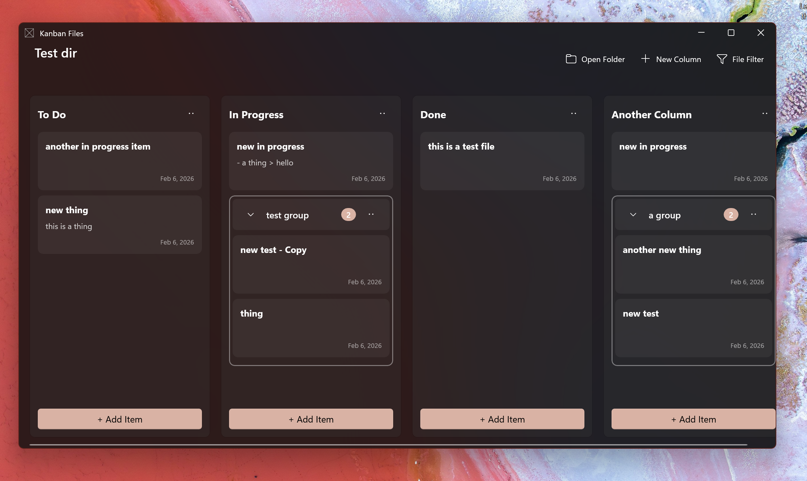

# KanbanFiles

> A local-first Kanban board powered by your file system. Organize markdown files as cards across columns, with full two-way synchronization.



KanbanFiles is a native Windows desktop application that transforms folders and markdown files into an interactive Kanban board. Changes made in the app are reflected instantly on disk, and external file changes automatically sync back to the board.


---

## ✨ Features

### 🗂️ **File System Integration**
- **Columns as Folders**: Each board column corresponds to a subfolder on disk
- **Items as Markdown Files**: Kanban cards are `.md` files with full markdown support
- **Two-Way Sync**: Changes made externally (VS Code, File Explorer, etc.) automatically appear in the app
- **Local-First**: All data lives in your file system—no cloud, no database, no lock-in

### 📋 **Kanban Board Management**
- **Create/Rename/Delete Columns**: Full CRUD operations with instant disk synchronization
- **Drag & Drop Items**: Move cards between columns (moves files on disk)
- **Drag & Drop Columns**: Reorder columns with persistent layout
- **Item Reordering**: Drag items within columns to customize sort order

### 🏷️ **Grouping & Organization**
- **Collapsible Groups**: Organize items within columns into named groups
- **Drag & Drop Groups**: Reorder groups and move items between them
- **Group Persistence**: Group configuration stored in `groups.json` per column

### 📝 **Rich Markdown Editing**
- **Split-Pane Editor**: Side-by-side markdown editing and live preview
- **Keyboard Shortcuts**: Quick formatting (Ctrl+B, Ctrl+I, Ctrl+K for bold/italic/links)
- **Theme-Aware Preview**: Automatic light/dark mode rendering via Markdig + WebView2
- **External Change Detection**: Auto-reload prompts when files are modified outside the app

### ⚡ **Productivity Features**
- **Keyboard Navigation**: 
  - `Ctrl+O`: Open folder
  - `Ctrl+N`: New item in first column
  - `Ctrl+Shift+N`: New column
  - `F5`: Refresh board
  - Arrow keys: Navigate between columns (←/→) and items (↑/↓)
- **Recent Folders**: Quick access to previously opened boards
- **Window State Persistence**: Remembers size, position, and maximized state

### 🛡️ **Robustness**
- **Automatic Backups**: Corrupt `.kanban.json` files are backed up with timestamps
- **Error Notifications**: Clear, actionable error messages via InfoBar
- **File Watcher Resilience**: Self-change suppression prevents duplicate events
- **Graceful Degradation**: Handles missing files, deleted columns, and edge cases

---

## 🚀 Getting Started

### Prerequisites
- **Windows 10** (version 1809, build 17763) or later
- **Windows 11** recommended for best performance
- **.NET 10 Runtime** (included with the app installer)

### Installation

#### Option 1: Download Release (Coming Soon)
1. Download the latest `.msix` installer from [Releases](https://github.com/TheJoeFin/kanban-files/releases)
2. Double-click to install
3. Launch KanbanFiles from the Start Menu

#### Option 2: Build from Source
```powershell
# Clone the repository
git clone https://github.com/TheJoeFin/kanban-files.git
cd kanban-files/KanbanFiles

# Restore dependencies and build
dotnet restore
dotnet build

# Run the application
dotnet run
```

### Quick Start
1. **Open a Folder**: Click "Open Folder" (Ctrl+O) and select a directory
2. **Auto-Setup**: If the folder is empty, KanbanFiles creates default columns ("To Do", "In Progress", "Done")
3. **Add Items**: Click "+ Add Item" in any column to create a markdown file
4. **Organize**: Drag items between columns, create groups, and customize your board

---

## 📂 How It Works

### File Structure
When you open a folder in KanbanFiles, it organizes files like this:

```
your-project/
├── .kanban.json          # Board configuration (columns, item order)
├── To Do/
│   ├── groups.json       # Group definitions for this column
│   ├── task-1.md         # Kanban item
│   └── task-2.md
├── In Progress/
│   ├── feature-x.md
│   └── bug-fix.md
└── Done/
    └── completed.md
```

### Configuration Files

#### `.kanban.json` (Board Config)
Stores column order, item sort order, and board metadata:
```json
{
  "columns": [
    {
      "name": "To Do",
      "folderName": "To Do",
      "sortOrder": 0,
      "itemOrder": ["task-1.md", "task-2.md"]
    }
  ]
}
```

#### `groups.json` (Column Groups)
Defines collapsible groups within a column:
```json
{
  "groups": [
    {
      "name": "High Priority",
      "items": ["urgent-bug.md", "critical-feature.md"],
      "isCollapsed": false
    }
  ]
}
```

### Two-Way Synchronization
KanbanFiles uses `FileSystemWatcher` to monitor all file changes:
- ✅ **Create** a `.md` file → Card appears in the board
- ✅ **Edit** a file in VS Code → Preview updates automatically
- ✅ **Rename** a file → Card title refreshes
- ✅ **Delete** a file → Card removed from the board
- ✅ **Move** a file between folders → Card moves to the corresponding column

---

## 🛠️ Technology Stack

- **Framework**: [WinUI 3](https://docs.microsoft.com/en-us/windows/apps/winui/winui3/) (Windows App SDK)
- **Language**: C# 13 with .NET 10
- **Architecture**: MVVM with [CommunityToolkit.Mvvm](https://github.com/CommunityToolkit/dotnet)
- **Markdown Rendering**: [Markdig](https://github.com/xoofx/markdig) + [WebView2](https://developer.microsoft.com/en-us/microsoft-edge/webview2/)
- **File Watching**: `System.IO.FileSystemWatcher` with debouncing and retry logic

---

## 📚 Project Structure

```
KanbanFiles/
├── Models/                   # Domain models (Board, Column, KanbanItem, Group)
├── Services/                 # Business logic services
│   ├── BoardConfigService.cs      # Read/write .kanban.json
│   ├── FileSystemService.cs       # File operations (CRUD, move, preview)
│   ├── FileWatcherService.cs      # External file change monitoring
│   ├── GroupService.cs            # Group management
│   ├── INotificationService.cs    # Error notification interface
│   └── RecentFoldersService.cs    # Recent folder tracking
├── ViewModels/               # MVVM ViewModels
│   ├── MainViewModel.cs           # Root board state
│   ├── ColumnViewModel.cs         # Column operations
│   ├── KanbanItemViewModel.cs     # Item state
│   ├── GroupViewModel.cs          # Group state
│   └── ItemDetailViewModel.cs     # Markdown editor state
├── Views/                    # WinUI3 XAML pages
│   └── MainPage.xaml              # Main board view
├── Controls/                 # Reusable UserControls
│   ├── ColumnControl.xaml         # Column header/footer/list
│   └── KanbanItemCardControl.xaml # Card UI
└── App.xaml.cs               # Application entry point
```

---

## ⌨️ Keyboard Shortcuts

### Global
- `Ctrl+O` - Open folder
- `F5` - Refresh board from disk

### Board Navigation
- `←` / `→` - Navigate between columns
- `↑` / `↓` - Navigate between items in a column

### Item Management
- `Ctrl+N` - Create new item in first column
- `Ctrl+Shift+N` - Create new column

### Markdown Editor
- `Ctrl+S` - Save changes
- `Ctrl+B` - Bold selection
- `Ctrl+I` - Italic selection
- `Ctrl+K` - Insert link
- `Escape` - Close dialog

---

## 🐛 Known Limitations

- **Windows Only**: Uses WinUI3, which is Windows-specific
- **Markdown Files Only**: Only `.md` files are displayed as Kanban items
- **Single Board per Folder**: One `.kanban.json` per directory
- **No Undo/Redo**: File operations are immediate (use Git for version control)

---

## 🗺️ Roadmap

- [ ] MSIX installer for easy distribution
- [ ] Search and filter items
- [ ] Tags/labels support
- [ ] Due dates and reminders
- [ ] Board templates
- [ ] Export to HTML/PDF
- [ ] Custom markdown themes

---

## 🤝 Contributing

Contributions are welcome! Please feel free to submit issues or pull requests.

### Development Setup
1. Install [Visual Studio 2022](https://visualstudio.microsoft.com/) with:
   - .NET desktop development workload
   - Windows App SDK C# Templates
2. Clone the repository
3. Open `KanbanFiles.sln`
4. Build and run (F5)

### Build Commands
```powershell
# Build
cd KanbanFiles
dotnet build

# Run
dotnet run

# Publish (single-file executable)
dotnet publish -c Release -r win-x64 --self-contained
```

---

## 📄 License

This project is licensed under the MIT License. See [LICENSE](LICENSE) for details.

---

## 🙏 Acknowledgments

- **[Markdig](https://github.com/xoofx/markdig)** - Fast and extensible Markdown processor
- **[CommunityToolkit.Mvvm](https://github.com/CommunityToolkit/dotnet)** - Modern MVVM framework
- **[WinUI 3](https://docs.microsoft.com/en-us/windows/apps/winui/winui3/)** - Native Windows UI framework

---

## 📧 Contact

**Joe Finney** - [@TheJoeFin](https://github.com/TheJoeFin) - joe at joefinapps dot com

**Project Link**: [https://github.com/TheJoeFin/kanban-files](https://github.com/TheJoeFin/kanban-files)

---

<p align="center">Made with ❤️ for productivity enthusiasts</p>
